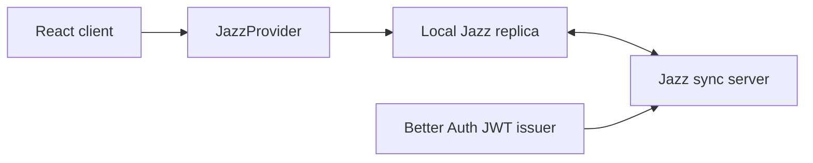

# Meridian V2 Software Architecture

## Architecture Goal

Create a Jazz 2.0 application that preserves Meridian's current workspace model while replacing the classic CoValue architecture with an explicit relational, permissioned, local-first design that stays easy to read, extend, and maintain.

## High-Level Product Model

Meridian V2 has two durable shared scopes and one lightweight personal layer:

1. Personal workspace context in the shell for recent items, pins, and preferences.
2. Organization context for shared structure, membership, people, and settings.
3. Project context for execution, documentation, and quality artifacts.

The personal workspace layer should stay lightweight. It is primarily a navigation and preference surface, not a second shared domain model.

## Recommended Stack

- React 19
- Vite 7
- React Router 7
- TypeScript 5
- Tailwind CSS 4
- shadcn and Radix UI primitives
- Jazz 2.0 via `jazz-tools@alpha`
- Better Auth with JWT support for production auth

## System Context



## Core Technical Decisions

- The client is local-first by default.
- The schema is relational and explicit.
- Permissions are first-class and live in `permissions.ts`.
- Production auth is external JWT-based.
- V1 uses organization membership as the default access boundary.
- V1 keeps most day-to-day work in project-owned records.
- V1 does not require a backend service layer for core workflows.
- The route model follows the current app's organization and project shell pattern.

## Simplicity Constraints

- Each durable row should have one obvious owner.
- Avoid generic scope patterns that allow one table to behave as both organization and project data without clear rules.
- Prefer one primary permission source in V1.
- Keep personal workspace behavior lightweight and user-specific.
- Add backend code only for trusted server-owned workflows that cannot be handled cleanly by the client and Jazz permissions.
- Defer optional complexity until a concrete user workflow requires it.

## Route Architecture

### Top-Level Routes

- `/`
- `/overview`
- `/organizations`

### Organization Routes

Default V1 routes:

- `/organizations/:orgId/overview`
- `/organizations/:orgId/projects`
- `/organizations/:orgId/people`
- `/organizations/:orgId/settings`

Optional follow-on routes if the product proves they are needed:

- `/organizations/:orgId/tasks/list`
- `/organizations/:orgId/tasks/board`
- `/organizations/:orgId/tasks/archive`
- `/organizations/:orgId/docs`

### Project Routes

- `/organizations/:orgId/projects/:projectId/overview`
- `/organizations/:orgId/projects/:projectId/tasks/list`
- `/organizations/:orgId/projects/:projectId/tasks/board`
- `/organizations/:orgId/projects/:projectId/tasks/archive`
- `/organizations/:orgId/projects/:projectId/requirements`
- `/organizations/:orgId/projects/:projectId/tests`
- `/organizations/:orgId/projects/:projectId/test-results`
- `/organizations/:orgId/projects/:projectId/docs`
- `/organizations/:orgId/projects/:projectId/people`
- `/organizations/:orgId/projects/:projectId/tags`
- `/organizations/:orgId/projects/:projectId/settings`

## Frontend Structure

```text
src/
  app/
    router/
    providers/
  features/
    shell/
    overview/
    organizations/
    projects/
    tasks/
    docs/
    people/
    requirements/
    tests/
    test-results/
    settings/
    tags/
  components/
    ui/
  lib/
    jazz/
    routes/
    formatting/
  schema.ts
  permissions.ts
  migrations/
```

## Jazz 2.0 App Boundaries

- `schema.ts` defines the structural schema.
- `permissions.ts` defines row-level access.
- `migrations/` stores reviewed migration edges.
- `JazzProvider` owns client config.
- The default template uses only the client, Jazz sync, and external JWT auth.
- Add backend jobs or trusted actions only when a workflow truly requires server-owned execution.
- If a backend is introduced later, keep it narrow and use `createJazzContext(...)` only inside those bounded workflows.

## Domain Model

The new app should prefer explicit tables over nested JSON or generic polymorphic records.

### Minimum V1 Shared Tables

| Table | Purpose |
|---|---|
| `organizations` | Shared workspace containers |
| `organization_memberships` | Which users belong to an organization and with what role |
| `projects` | Delivery spaces inside an organization |
| `profiles` | User-facing profile metadata if stored app-side |
| `user_preferences` | Optional cross-device pins and recent-item state if local-only storage is not enough |

### Organization Reference Tables

| Table | Purpose |
|---|---|
| `people` | Contact or stakeholder records at organization scope |
| `project_people` | Link people into a project context |

### Project Execution Tables

| Table | Purpose |
|---|---|
| `task_columns` | Board and list grouping for project tasks |
| `tasks` | Track work items, status, assignee, ordering, and details |
| `tags` | Reusable tags at project scope |
| `task_tags` | Many-to-many link between tasks and tags |
| `documents` | Hierarchical document tree using `parentId` |
| `requirements` | Hierarchical requirement tree |
| `tests` | Hierarchical test tree with folder support |
| `test_reports` | A record of a test run or report |
| `test_results` | The result of individual tests inside a report |

### Deferred By Default

| Table | Purpose |
|---|---|
| `project_memberships` | Only add if some projects need access rules that differ from organization membership |
| `organization_documents` | Add only if organization-level reference docs prove necessary beyond project docs |
| `organization_tasks` | Add only if organization-level work cannot be represented as project work or cross-project views |
| `files` | File metadata for uploads |
| `file_parts` | File chunk storage |
| `attachments` | Link files to documents, tasks, requirements, tests, or results |

## Suggested Table Shape Notes

- `documents.parentId`, `requirements.parentId`, and `tests.parentId` should model hierarchy directly.
- `tasks`, `task_columns`, `tags`, `documents`, `requirements`, `tests`, `test_reports`, and `test_results` should be project-owned in V1.
- If organization-level tasks or docs are added later, use separate org-owned tables instead of forcing one table to support both scopes implicitly.
- Pins and recents should default to local UI state first. Only add `user_preferences` when cross-device continuity becomes a real requirement.
- Rich content should default to `s.string()` for editorial body text so the UI editor can evolve later without forcing a complex schema.
- Custom metadata that truly behaves as an atomic blob can use `s.json()`.

## Permissions Model

### Roles

- Reader
- Writer
- Manager
- Admin

### Default Access Boundary

- `organization_memberships` is the only required membership table in V1.
- Project access inherits from the parent organization by default.
- Add `project_memberships` only when a real workflow requires project access rules that differ from organization membership.

### Organization Rules

- Organization members can read their organization.
- Writers, managers, and admins can create projects and organization reference records where appropriate.
- Managers and admins can manage memberships, settings, and destructive actions.

### Project Rules

- Organization members can read projects in their organization by default.
- Project content inherits access from the project using `allowedTo.*("projectId")`.
- Project settings are limited to managers and admins.
- If project-specific membership is later introduced, it should arrive as a separate schema and ADR decision rather than hidden policy drift.

### Content Inheritance

- `people` and other future organization reference records inherit from `organizationId`.
- Project tasks, tags, requirements, tests, results, docs, and linked people inherit from `projectId`.
- Join tables like `project_people` and `task_tags` must be protected from arbitrary mutation.

## Auth Strategy

### Default Recommendation

Use external JWT auth in production with Better Auth.

Why:

- It matches Jazz 2.0's strongest documented production pattern.
- It supports stable user accounts, shared workspaces, and role-based permissions.
- It avoids carrying forward the old app's auth assumptions into the new template.

For V1, keep auth intentionally boring:

- start with durable signed-in accounts
- avoid building account-upgrade flows into the initial template
- treat auth-mode switching as a later architecture decision, not a default capability

### Deferred Auth Complexity

Support a local-first trial mode for personal workspace exploration before sign-up.

If this is added later:

- local-first users must have a recovery path
- upgrading to external auth must preserve Jazz identity
- the JWT `sub` must be the Jazz user id

## Optional Backend Extension

Do not add a backend service layer for ordinary CRUD, list loading, or permission checks that Jazz can already handle on the client.

Add backend workflows only for cases such as:

- scheduled exports or reports
- webhooks or third-party integrations
- admin-only repair tooling
- trusted server-owned jobs

If a backend is added later, keep it in narrow workflow modules instead of routing all business logic through a generic server layer.

## Query Strategy

- Use small route-level queries that match each page's actual visible surface.
- Use subscriptions for live lists and trees.
- Use `select(...)` and narrow `include(...)` shapes on dense views.
- Sort before paginating.
- Let organization screens prefer shallow summaries and cross-project views before inventing parallel organization-owned copies of project data.
- Prefer detail-pane queries that subscribe only to the selected record and minimal supporting relations.

## Write Strategy

- Most writes should resolve locally first without extra optimistic state code.
- Use local durability by default.
- Use edge durability for creation flows that should confirm server reachability.
- Reserve global durability for truly cross-region consistency requirements.

## Shell And Layout Strategy

- `BaseLayout` holds header, breadcrumbs, and route outlet.
- `OrganizationLayout` provides contextual sidebar navigation and content shell.
- `ProjectLayout` does the same for projects.
- Mobile uses drawers that preserve the same IA as desktop.
- Detail panes should stay feature-local and reusable across list and board views.

## Offline And Sync Expectations

- Previously loaded data should remain available offline.
- Writes should feel immediate when the user edits notes or work items.
- The UI should show enough state to preserve trust without turning sync into a dominant visual concern.
- The app should gracefully reconnect and replay subscriptions.

## Performance Guidelines

- Avoid broad includes on large trees or boards.
- Keep task, requirement, and test subscriptions scoped to the active screen.
- Use stable ordering fields for drag and drop views.
- Keep recent and pinned navigation queries shallow and user-specific.

## Migration Guidance

- Every shared schema change needs validation and a reviewed migration.
- Permission-only changes still require deployment.
- The current V1 schema should be treated as inspiration, not a direct port target.
- Prefer additive changes with explicit ownership over generic scope columns or catch-all metadata.
- If the team migrates existing Meridian data later, it should happen through a separate migration plan rather than inside the template itself.

## Documentation And Change Governance

The template should remain self-documenting at the repository level.

### Documentation Roles

- `docs/features/` is the source of truth for user-facing behavior and implementation tracking.
- `docs/design/` holds the product brief, delivery plan, and architecture guidance.
- `docs/adrs/` holds durable architecture decisions that should not be buried in commit history.
- `docs/release-notes/` holds versioned summaries of what changed and why it matters.

### ADR Rules

- Create a numbered ADR when a change affects shared architecture, schema shape, permissions strategy, auth mode, routing model, offline guarantees, or deployment assumptions.
- Keep ADRs append-only in intent. When a decision changes, add a new ADR that supersedes the older one instead of silently rewriting history.
- Use one stable format for ADRs: status, context, decision, consequences, and follow-up.
- Cross-link ADRs from affected design docs, migrations, and release notes when the connection matters.

### Release Notes And Versioning

- Keep one markdown file per released version in `docs/release-notes/`, named with the version number.
- Use semantic versioning for the template:
  - major for breaking architecture resets, incompatible schema or route changes, or removed core workflows
  - minor for new feature families, new capabilities, or materially expanded behavior
  - patch for fixes, clarifications, documentation improvements, and other non-breaking refinements
- Every change that alters shared behavior, architecture, migration expectations, or developer workflow should update the relevant release note in the same change.
- Schema, permissions, and migration-related releases should mention the operational impact and link to the relevant ADR when the change reflects a durable decision.

### Documentation Update Rules

- Architecture changes update `docs/design/` and, when the decision is durable, add or update an ADR.
- Behavior changes update the relevant feature file and the affected tests together.
- Shipped changes update `docs/release-notes/` alongside the implementation or documentation change.

## Testing Strategy

- The feature files in `docs/features/` are the source of truth.
- Add E2E coverage by route family and behavior, not by internal component shape.
- Validate permissions by role and scope.
- Validate offline reads, reconnects, and conflict-safe edits on core workflows.

## Architecture Review Checklist

- [ ] Each primary screen has a corresponding route and query boundary.
- [ ] Each primary entity has an explicit table, not a hidden JSON shape.
- [ ] Each table has an access-control story in `permissions.ts`.
- [ ] Personal workspace behavior stays lightweight and does not turn into a second shared data model by accident.
- [ ] Each durable record has one obvious owner.
- [ ] Organization membership is the only required access source unless a later ADR justifies more.
- [ ] No backend service layer is required for core workflows.
- [ ] The docs define where behavior, architecture decisions, and release history live.
- [ ] Versioning rules are simple enough to apply consistently.
- [ ] Organization and project scope are kept distinct in both schema and routing.
- [ ] Detail panes and collection views share one source of truth for record state.
- [ ] The design supports future visual redesign without changing core product structure.