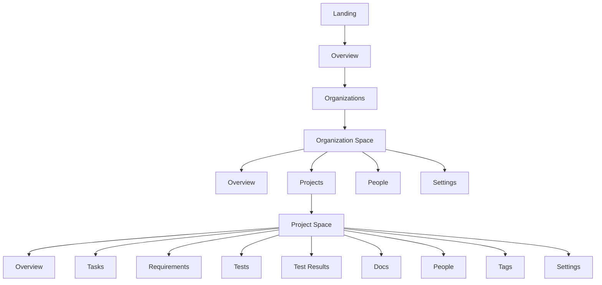
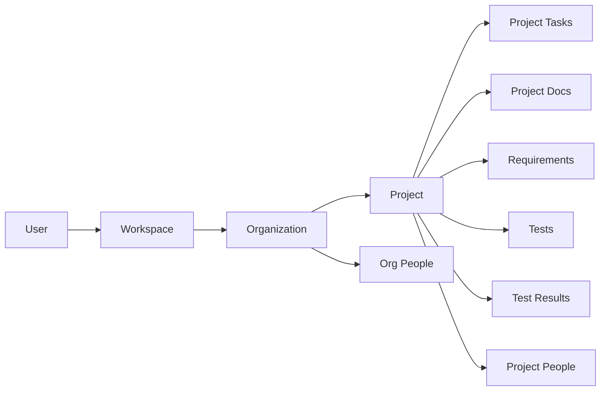

# Meridian V2 Feature Summary And Breakdown

## Why This File Exists

This is the fastest entry point into the Meridian V2 template.

Read this file first if you want to understand:

- what the application is for
- what ideas define the product
- how the main spaces relate to each other
- which detailed feature files to read next

This file stays intentionally simple. The deeper details live in the linked design docs, architecture docs, and feature files.

## Product In One Sentence

Meridian V2 is a cozy local-first workspace where small teams keep notes, tasks, people, requirements, tests, and results connected inside shared organization and project spaces.

## What The Application Is Trying To Do

The application exists to reduce the distance between conversation and execution.

Instead of scattering work across separate tools, Meridian keeps the following together:

- team context
- project planning
- active execution
- reference notes
- delivery quality evidence

## The Core Product Ideas

### 1. The Workspace Should Feel Calm

The application should feel like a focused notebook, not a noisy operations dashboard.

### 2. Context Should Stay Visible

Users should always know whether they are looking at workspace, organization, or project-level information.

### 3. Work Should Be Local-First

The product should feel responsive immediately, with synchronization happening in the background instead of blocking ordinary work.

### 4. Planning And Delivery Should Live Together

Notes, tasks, requirements, tests, and results belong in the same product because teams need them together to make decisions.

### 5. The Structure Should Be Easy To Redesign Visually Later

The information architecture and feature definitions should be stable enough that future UI or UX work can improve the visuals without rewriting the product logic.

## Who The Application Is For

- Small teams managing multiple projects.
- Team leads who need to see work, ownership, and progress quickly.
- Contributors who move between notes, tasks, tests, and documentation during daily work.
- Designers and product collaborators who need a human-readable map of the system.

## The Main Spaces

| Space | What It Is For | Main Things A User Does There |
|---|---|---|
| Landing | Explain the product and invite entry into the workspace | Understand the promise, enter the workspace |
| Overview | Resume work quickly | Review assigned work, recent activity, shortcuts |
| Organizations | Manage shared team workspaces | Create orgs, browse orgs, enter org context |
| Organization Space | Shared structure and coordination above any single project | Review projects, people, settings, and cross-project summaries |
| Project Space | Focused delivery environment | Manage tasks, docs, requirements, tests, results, people, settings |
| Settings And Governance | Control roles, membership, identifiers, and destructive actions | Manage permissions, maintenance, and safe changes |

## The Main Feature Groups

| Feature Group | Why It Exists | Detailed File |
|---|---|---|
| Foundation and navigation | Keep users oriented and help them enter the right context quickly | [01-foundation-and-navigation.md](01-foundation-and-navigation.md) |
| Organizations and projects | Model the main workspace hierarchy | [02-organizations-and-projects.md](02-organizations-and-projects.md) |
| Tasks and execution | Move work from backlog to completion | [03-tasks-and-execution.md](03-tasks-and-execution.md) |
| Documents and knowledge | Preserve notes, decisions, and reference material | [04-documents-and-knowledge.md](04-documents-and-knowledge.md) |
| People, collaboration, and permissions | Show who is involved and who can act | [05-people-collaboration-and-permissions.md](05-people-collaboration-and-permissions.md) |
| Requirements, tests, and results | Support delivery discipline and quality visibility | [06-requirements-tests-and-results.md](06-requirements-tests-and-results.md) |
| Settings, tags, and governance | Handle structure, labeling, and safety | [07-settings-tags-and-governance.md](07-settings-tags-and-governance.md) |

## Information Architecture At A Glance

## Concept Model At A Glance

## How Designers Should Use This

Read in this order:

1. This summary file.
2. [../design/meridian-v2-design-brief.md](../design/meridian-v2-design-brief.md)
3. The relevant feature file for the screen family you are working on.
4. The architecture doc only when product structure or data relationships matter.

Focus on:

- page families
- context shifts between workspace, organization, and project
- where density helps users versus where calm is more important
- how detail panes, trees, and boards support different kinds of work

## How Developers Should Use This

Read in this order:

1. This summary file.
2. [../design/meridian-v2-software-architecture.md](../design/meridian-v2-software-architecture.md)
3. The relevant detailed feature file.
4. [../design/meridian-v2-template-plan.md](../design/meridian-v2-template-plan.md) for rollout planning.

Use this file to understand the product boundary before reading the implementation detail.

## Related Resources

### Strategy And Design

- [../design/meridian-v2-template-plan.md](../design/meridian-v2-template-plan.md)
- [../design/meridian-v2-design-brief.md](../design/meridian-v2-design-brief.md)
- [../design/meridian-v2-software-architecture.md](../design/meridian-v2-software-architecture.md)

### Detailed Features

- [01-foundation-and-navigation.md](01-foundation-and-navigation.md)
- [02-organizations-and-projects.md](02-organizations-and-projects.md)
- [03-tasks-and-execution.md](03-tasks-and-execution.md)
- [04-documents-and-knowledge.md](04-documents-and-knowledge.md)
- [05-people-collaboration-and-permissions.md](05-people-collaboration-and-permissions.md)
- [06-requirements-tests-and-results.md](06-requirements-tests-and-results.md)
- [07-settings-tags-and-governance.md](07-settings-tags-and-governance.md)

### Architecture Decision

- [../adrs/001-adopt-jazz-v2-local-first-workspace.md](../adrs/001-adopt-jazz-v2-local-first-workspace.md)

### Current-App Visual And Structural References

- [../../src/components/pages/LandingPage.tsx](../../src/components/pages/LandingPage.tsx)
- [../../src/components/layouts/BaseLayout.tsx](../../src/components/layouts/BaseLayout.tsx)
- [../../src/components/layouts/OrganizationLayout.tsx](../../src/components/layouts/OrganizationLayout.tsx)
- [../../src/components/layouts/ProjectLayout.tsx](../../src/components/layouts/ProjectLayout.tsx)
- [../../src/index.css](../../src/index.css)

## What Success Looks Like

Someone new to the project should be able to read this file in a few minutes and understand:

- what Meridian V2 is
- what the main spaces are
- what work the product supports
- which detailed document to open next

## V1 Scope Guardrails

- Organization spaces are primarily for shared structure, membership, people, settings, and cross-project orientation.
- Project spaces own the main execution and knowledge workflows such as tasks, docs, requirements, tests, results, and tags.
- Personal workspace behavior should stay lightweight and mostly limited to navigation, recents, pins, and profile access.